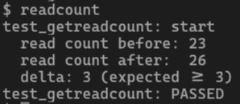
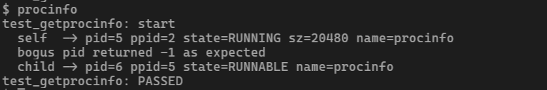
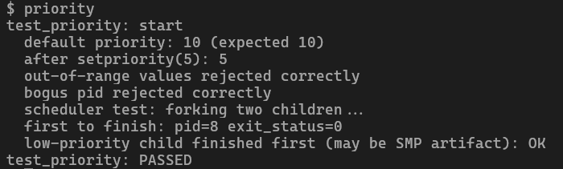
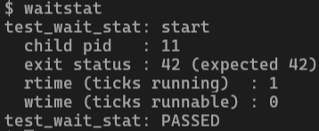
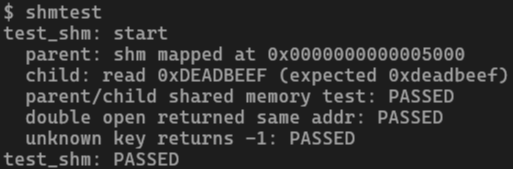

# Project 1 — Technical Documentation

**Group:** G9  
**Kernel:** xv6-riscv

---

## Build & Run

```bash
cd Project1_xv6_custom_sys_calls/xv6-riscv
make qemu          # full build + QEMU
make CPUS=1 qemu   # single-CPU (clearer priority demo)
# Exit: Ctrl-A x
```

---

## Syscall 1 — `getreadcount`
**Implemented by - Kartik Lolla**

### Purpose
Returns the total number of `read()` system calls made system-wide since boot. Useful for profiling or auditing I/O activity.

### Kernel Implementation
- `kernel/proc.c`: global `int readcount` and `struct spinlock readcount_lock` declared at file scope. `procinit()` calls `initlock(&readcount_lock, "readcount")`.  
- `increment_readcount()`: acquires lock, increments, releases.  
- `getreadcount()`: acquires lock, reads value, releases, returns it.  
- `kernel/sysfile.c` — `sys_read()`: calls `increment_readcount()` before returning `fileread(...)`.

### Files Modified
`kernel/syscall.h`, `kernel/syscall.c`, `kernel/sysproc.c`, `kernel/defs.h`, `kernel/proc.c`, `kernel/sysfile.c`, `user/user.h`, `user/usys.pl`, `Makefile`

### New File
`user/readcount.c`

### User Test Program
```
$ readcount
```
Creates a pipe, writes 3 bytes, does 3 `read()` calls, asserts counter delta ≥ 3.

### Execution Screenshot



---

## Syscall 2 — `getprocinfo`
**Implemented by - Kartik Lolla**

### Purpose
Allows any process to inspect the state of any other live process by PID — its parent PID, scheduler state, memory size, and name. Analogous to a simplified `/proc/<pid>/status`.

### Kernel Implementation
- `kernel/procinfo.h`: defines `struct procinfo { int pid; int ppid; int state; uint64 sz; char name[16]; }`. Included by both kernel and user programs.  
- `getprocinfo(int pid, uint64 addr)` in `kernel/proc.c`: walks `proc[]`, acquires `p->lock` for each entry, compares PID. On match, copies fields to a stack-local struct, releases the lock, then calls `copyout()` to write to user memory. Returns 0 on success, -1 if not found or `copyout` fails.

### Files Modified
`kernel/syscall.h`, `kernel/syscall.c`, `kernel/sysproc.c`, `kernel/defs.h`, `kernel/proc.c`, `user/user.h`, `user/usys.pl`, `Makefile`

### New Files
`kernel/procinfo.h`, `user/procinfo.c`

### User Test Program
```
$ procinfo
```
Queries self, a bogus PID (expects -1), and a forked child.

### Execution Screenshot



---

## Syscall 3 — `setpriority` / `getpriority`
**Implemented by - Kartik Lolla**

### Purpose
Gives processes a numeric priority that the scheduler respects. Lower priority number = higher urgency. Default 10, range 1–20.

### Kernel Implementation
- `kernel/proc.h`: `int priority` added to `struct proc`.  
- `allocproc()`: sets `p->priority = 10`.  
- `setpriority(int pid, int priority)`: walks `proc[]` under per-proc lock; validates range 1–20; sets field. Returns 0 / -1.  
- `getpriority(int pid)`: same walk, returns `p->priority` or -1.  
- `scheduler()` rewritten as **two-pass**:
  - Pass 1: scan all RUNNABLE processes (lock/unlock each), track lowest priority value seen.
  - Pass 2: scan again, run first RUNNABLE process whose priority equals that minimum.
  - Never holds two proc locks at once — no new deadlock risk.

### Files Modified
`kernel/syscall.h`, `kernel/syscall.c`, `kernel/sysproc.c`, `kernel/defs.h`, `kernel/proc.h`, `kernel/proc.c`, `user/user.h`, `user/usys.pl`, `Makefile`

### New File
`user/priority.c`

### User Test Program
```
$ priority          # any CPUS
make CPUS=1 qemu   # then run priority — clearest scheduler result
```
Tests default, set/get, out-of-range rejection, bogus PID, and scheduler ordering.

### Execution Screenshot



---

## Syscall 4 — `wait_stat`
**Implemented by - Kartik Lolla**

### Purpose
Extended `wait()` that surfaces timing data about a child process: how long it waited in the RUNNABLE queue and how long it actually ran on CPU.

### Kernel Implementation
- `kernel/proc.h`: three new fields in `struct proc`:  
  - `uint ctime` — tick when process was created (`allocproc`)  
  - `uint rtime` — ticks spent RUNNING  
  - `uint stime` — ticks spent RUNNABLE  
- `kernel/trap.c` — `clockintr()`: calls `update_time_stats()` (CPU 0 only, once per tick).  
- `update_time_stats()` in `kernel/proc.c`: walks entire `proc[]` table under per-proc locks; increments `rtime` for RUNNING, `stime` for RUNNABLE.  
- `kwait_stat(uint64 wtime, uint64 rtime, uint64 status)`: mirrors `kwait()` — scans for zombie child. Before calling `freeproc`, `copyout`s `pp->stime`, `pp->rtime`, and `pp->xstate` to the three user pointers. Returns child PID.

### Files Modified
`kernel/syscall.h`, `kernel/syscall.c`, `kernel/sysproc.c`, `kernel/defs.h`, `kernel/proc.h`, `kernel/proc.c`, `kernel/trap.c`, `user/user.h`, `user/usys.pl`, `Makefile`

### New File
`user/waitstat.c`

### User Test Program
```
$ waitstat
```
Forks a spin-loop child (exit 42), calls `wait_stat`, prints rtime/wtime/status.

### Execution Screenshot



---

## Syscall 5 — `shm_open` / `shm_close`
**Implemented by - Kartik Lolla**

### Purpose
Shared-memory IPC: lets two or more processes map the same physical pages into their address spaces and communicate through them directly, without copying through the kernel.

### Kernel Implementation
**Data structures** (`kernel/shm.h`):
```c
struct shmregion {      // global table entry
  int    key;
  int    npages;
  uint64 pages[4];      // physical page addresses
  int    refcount;
};
struct shmattach {      // per-process attachment record
  int    key;
  uint64 uva;           // mapped virtual address in this process
  int    npages;
};
```

**`kernel/shm.c`**:
- `shminit()`: called from `main()`, inits spinlock and zeroes table.
- `shm_open(int key, int size)`:
  1. Round `size` up to pages (clamp to 4 pages max).
  2. Under `shm_lock`, find existing slot for `key` or allocate a new one.
  3. If new: `kalloc()` each page, `memset` to zero.
  4. If already attached by this process: return existing VA.
  5. `mappages()` the physical pages into the process's page table at `p->sz`, using `PTE_R | PTE_W | PTE_U`.
  6. Advance `p->sz`, record attachment in `p->shm[]`, increment `refcount`.
  7. Return user virtual address.
- `shm_close(int key)`:
  1. Find per-process attachment slot.
  2. `uvmunmap()` the pages (do_free=0: keep physical memory alive).
  3. Clear attachment slot. Decrement `refcount`.
  4. If `refcount == 0`: `kfree()` all physical pages, clear global slot.

**`kernel/proc.h`**: `struct shmattach shm[8]` added to `struct proc`.  
**`kernel/main.c`**: `shminit()` called after `procinit()`.

### Files Modified
`kernel/syscall.h`, `kernel/syscall.c`, `kernel/sysproc.c`, `kernel/defs.h`, `kernel/proc.h`, `kernel/main.c`, `user/user.h`, `user/usys.pl`, `Makefile`

### New Files
`kernel/shm.h`, `kernel/shm.c`, `user/shmtest.c`

### User Test Program
```
$ shmtest
```
Parent writes `0xdeadbeef` into page, child maps same key and reads it back. Also tests double-open and unknown-key close.

### Execution Screenshot



---

## Syscall 6 — mutex_init / mutex_lock / mutex_unlock
**Implemented by: K-Mohan26**

### Purpose
xv6 already has spinlocks inside the kernel but normal user programs cannot use them at all. so i added 3 new system calls so that user processes can also create and use mutex locks for synchronization. this is useful when two processes share data and we dont want both accessing it at same time.

### System Calls
- `mutex_init(int id)` — initializes a mutex at slot id (0 to 15). returns 0 on success, -1 if id is out of range
- `mutex_lock(int id)` — tries to acquire the lock. if already held by another process, current process blocks (sleeps) until it is released
- `mutex_unlock(int id)` — releases the lock and wakes up any process that was waiting for it. only the owner process can unlock

### How it works
i added a global array `mutextable[16]` of `struct umutex` in kernel/sysproc.c. each entry has 3 fields — valid (is slot in use), locked (is lock taken), owner_pid (which process holds it). mutexinit() is called at boot to zero everything out. mutex_lock uses `__sync_lock_test_and_set` for atomic locking so there are no race conditions even on multi cpu systems. mutex_unlock uses `__sync_lock_release` to atomically clear the lock and then wakes up waiting processes.

### Files Modified
| File | Change |
|------|--------|
| kernel/mutex.h | new file — defines struct umutex and MAX_MUTEXES |
| kernel/sysproc.c | added mutexinit, sys_mutex_init, sys_mutex_lock, sys_mutex_unlock |
| kernel/syscall.h | added SYS_mutex_init=29, SYS_mutex_lock=30, SYS_mutex_unlock=31 |
| kernel/syscall.c | registered the 3 new syscalls in dispatch table |
| kernel/defs.h | added function declarations |
| kernel/main.c | added mutexinit() call at boot |
| user/user.h | added user-space prototypes |
| user/usys.pl | added syscall stubs |
| user/mutextest.c | new file — test program |

### Test Program
$ mutextest

### Execution Screenshot
Execution Screenshot


---

## xv6 Syscall Pipeline (applied to every syscall)

| Step | File | What to add |
|------|------|-------------|
| 1 | `kernel/syscall.h` | `#define SYS_name <N>` |
| 2 | `kernel/syscall.c` | `extern uint64 sys_name(void);` + `[SYS_name] sys_name,` |
| 3 | `kernel/sysproc.c` | `sys_name()` wrapper using `argint`/`argaddr` |
| 4 | `kernel/defs.h` | Declaration of the real implementation |
| 5 | `kernel/proc.c` (or new file) | Real implementation |
| 6 | `user/user.h` | User-space prototype |
| 7 | `user/usys.pl` | `entry("name");` |
| 8 | `user/<test>.c` | Test program |
| 9 | `Makefile` | `$U/_<test>` in `UPROGS` |

---

## Real application demos built on these syscalls

The test files prove correctness, but these extra user programs show the syscalls being used like normal OS tools.

### 1. `readcountdemo`
Counts how many `read()` syscalls happen while reading a real file or stdin.

Example:
```bash
readcountdemo README
```

### 2. `ps`
Lists live xv6 processes by scanning PIDs and calling `getprocinfo()`.

Example:
```bash
ps
```

### 3. `scheddemo`
Starts two CPU-bound children with different priorities to show priority scheduling.

Example:
```bash
scheddemo
```

Best run:
```bash
make CPUS=1 qemu
```

### 4. `timebench`
Runs a command and prints its runnable and running ticks using `wait_stat()`.

Example:
```bash
timebench wc README
```

### 5. `shmdemo`
Shows parent and child sharing a memory region and updating the same data.

Example:
```bash
shmdemo
```

### 6. `mutexdemo`
Uses shared memory plus `mutex_lock()` / `mutex_unlock()` to protect a shared counter.

Example:
```bash
mutexdemo
```

The new programs are added in [xv6-riscv/Makefile](xv6-riscv/Makefile) under `UPROGS`, so they are built into `fs.img` automatically.

---

