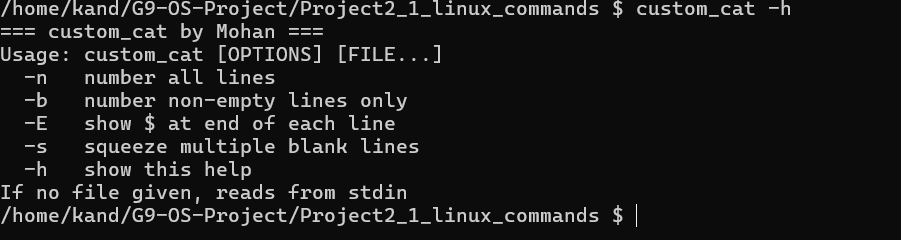
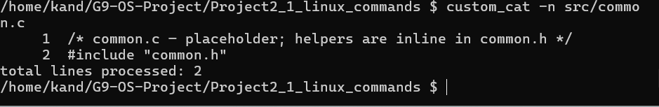
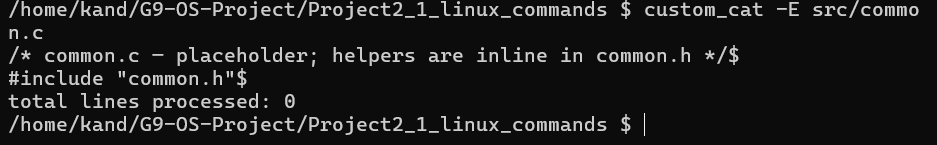
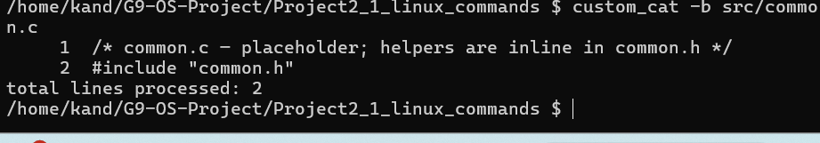
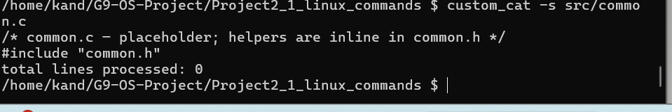

# Project 2 — Technical Documentation

**Group:** G9

---

## Build & Test

```bash
cd Project2_1_linux_commands
make
make clean
```

CFLAGS: `-Wall -Wextra -O2 -std=c11 -D_POSIX_C_SOURCE=200809L -D_XOPEN_SOURCE=500`

---

## common.h / common.c

Shared helpers used by all utilities:

- `die(prog, msg)` — prints `prog: msg: strerror(errno)` to stderr and calls `exit(1)`.
- `die_msg(prog, msg)` — same but without appending errno.
- `warn(prog, msg)` — prints error to stderr but does not exit (used to continue processing remaining files).

All three are `static inline` in the header so no separate compilation unit is needed; `common.c` is a placeholder.

---

## custom_ls

**Key design decisions:**
- Uses `opendir`/`readdir` to list entries, `lstat` (not `stat`) so symlinks show as `l` rather than following to the target.
- All entries are collected into a dynamically grown `char **` array and sorted alphabetically before printing — mirrors the standard `ls` ordering.
- Long format (`-l`) builds a 10-char permission string from the `stat.st_mode` bitmask, then calls `strftime` for the mtime.

**Edge cases handled:**
- Multiple directory arguments: prints each directory name as a header.
- Hidden files: filtered unless `-a` is set.
- `lstat` failure on an individual entry: warns and continues.

---

## custom_cat
**Implemented by:** Kandlavathu Mohan Naik(24JE0631)

**Key design decisions:**
- Uses `fgetc` to read one character at a time, which allows line-aware flag processing without buffering full lines.
- A global `my_line_cnt` is carried across multiple file arguments so line numbers are continuous throughout the output.
- `-b` (number non-empty lines) takes precedence over `-n` (number all lines) when both are given — `-n` is cleared after flag parsing.
- `-s` suppresses consecutive blank lines by tracking an `empty_lines` counter; only the first blank line in a run is printed.
- `-E` prints a literal `$` character immediately before every `\n`.
- Prints total lines processed to **stderr** on exit (only when processing files), so the count does not pollute piped output.
- `-` as a filename means stdin, allowing it to be mixed with real files.

**Edge cases handled:**
- `fgetc` EOF vs read error distinguished via `ferror(fp)`.
- `-b` and `-n` together: `-b` wins, non-empty lines are numbered, blank lines get no number prefix.
- Last line with no trailing newline: rendered correctly since the `\n` branch is only triggered on actual newlines.

### Screenshots






---

## custom_grep

**Key design decisions:**
- Uses `getline(3)` (POSIX.1-2008) for line-by-line reading — handles arbitrarily long lines without a fixed buffer.
- Case-insensitive mode (`-i`) lowercases both the pattern and each input line into `malloc`'d buffers, then calls `strstr`. This avoids modifying the original line.
- Exit status: 0 if at least one match found across all files, 1 otherwise — same convention as POSIX `grep`.

**Edge cases handled:**
- Multiple files: prefixes each match with `filename:` only when more than one file is given.
- Files that fail to open: warns and continues to the next file.
- Last line with no trailing newline: adds one before printing.

---

## custom_wc

**Key design decisions:**
- Reads in 64 KiB chunks via `read(2)` and counts in a single pass over the buffer.
- Word counting: tracks an `in_word` boolean that flips on `isspace` transitions — same algorithm as POSIX `wc`.
- Selective output: if `-l`, `-w`, or `-c` are specified, only those columns print; if none are specified, all three print.

**Edge cases handled:**
- Multiple files: prints a `total` row.
- Stdin: handled when no file arguments are given.

---

## custom_cp

**Key design decisions:**
- Uses `getopt(3)` for flag parsing: `-i` (interactive overwrite prompt) and `-v` (verbose `src -> dest` output).
- Opens source with `O_RDONLY`, reads `stat` to get the mode, opens destination with `O_CREAT | O_TRUNC | mode` — preserves permission bits.
- Copy loop retries on short writes until all bytes are flushed.
- Destination directory detection: `stat(dst)` + `S_ISDIR` check; if true, appends the source basename via `basename(3)` into a `PATH_MAX` buffer.
- Same-file detection: compares `st_dev` and `st_ino` between source and resolved destination — aborts with an error rather than clobbering.
- `-i` uses `access(F_OK)` to check if the destination already exists before prompting.

**Edge cases handled:**
- Same source and destination (including through a directory): detected and rejected.
- Write errors mid-copy: warns and returns without cleaning up the partial file.
- Exactly two positional arguments required (`src dest`); more or fewer prints usage and exits.

---

## custom_mv

**Key design decisions:**
- Uses `getopt(3)` for flag parsing: `-i` (interactive overwrite prompt) and `-v` (verbose `src -> dest` output).
- Tries `rename(2)` first — O(1) operation when source and destination are on the same filesystem.
- On `EXDEV` (different filesystems): falls back to `copy_and_unlink` which copies byte-by-byte then calls `unlink(2)` on the source.
- On copy failure mid-way: calls `unlink(dst)` to remove the partial copy before returning error.
- Same-file detection: compares `st_dev` and `st_ino` between source and resolved destination.
- `-i` uses `access(F_OK)` to check if the destination already exists before prompting.

**Edge cases handled:**
- Cross-device move: transparent fallback via `copy_and_unlink`.
- Failed copy: cleans up partial destination before returning.
- Directory destination: appends source basename via `basename(3)`.
- Same source and destination (including through a directory): detected and rejected.
- Exactly two positional arguments required (`src dest`).

---

## custom_rm

**Key design decisions:**
- Uses `lstat` (not `stat`) to detect symlinks — a symlink to a directory is removed with `unlink`, not `rmdir`.
- Recursive removal is depth-first: recurse into children first, then `rmdir` the (now empty) directory.
- Without `-r`: refuses directories with a clear error message rather than silently skipping.

**Edge cases handled:**
- `.` and `..` are skipped during recursion.
- Partial failures in recursive removal: continue with remaining entries, return non-zero at the end.
- `-R` (uppercase) accepted as synonym for `-r`.

---

## custom_shell

### Architecture

The shell is a read-eval-print loop with five layers:

```
prepend_bin_dir_to_path → fgets → tokenize → parse_pipeline → run_pipeline
```

**PATH bootstrap** (`prepend_bin_dir_to_path`): called once at startup before the REPL begins. Reads the shell's own executable path via `readlink("/proc/self/exe")`, strips the filename to get the directory, and prepends it to `$PATH` with `setenv`. This ensures all `custom_*` siblings in `bin/` are findable by `execvp` without the user needing to configure `$PATH` manually.

**Tokenizer** (`tokenize`): splits the input line on whitespace in-place, producing a `char *[]` of tokens.

**Parser** (`parse_pipeline`): scans tokens left-to-right and fills an array of `Cmd` structs. Each `|` starts a new `Cmd`. Tokens `<`, `>`, `>>` consume the next token as a filename and store it in `redir_in` / `redir_out`. A trailing `&` sets the `background` flag.

**Built-in handler** (`run_builtin`): checks for `exit`, `cd`, `pwd` before forking. Built-ins in a pipeline fall through to `run_pipeline` and run in a fork (necessary so their I/O can be piped).

**Pipeline executor** (`run_pipeline`):
1. Allocates `ncmds - 1` pipes with `pipe(2)`.
2. Forks one child per command.
3. Each child wires its stdin/stdout to the appropriate pipe ends with `dup2(2)`, applies any `<`/`>` redirections, then calls `execvp`.
4. The parent closes all pipe ends and calls `waitpid` for each child (or skips wait if `background`).

### Redirection

Applied in the child after `dup2` for pipes, before `execvp`:
- `<`: `open(O_RDONLY)` → `dup2(fd, STDIN_FILENO)` → `close(fd)`
- `>`: `open(O_WRONLY|O_CREAT|O_TRUNC, 0644)` → `dup2(fd, STDOUT_FILENO)` → `close(fd)`
- `>>`: same but `O_APPEND` instead of `O_TRUNC`

### Background execution

The parent skips `waitpid` for background jobs and prints the last child's PID. Background processes are reaped opportunistically at the top of each REPL iteration with `waitpid(-1, NULL, WNOHANG)`.

### Edge cases handled
- EOF on stdin (Ctrl-D): `fgets` returns NULL → clean exit.
- Blank and comment (`#`) lines: skipped.
- Unknown command: `execvp` fails → child prints error and exits 127.
- Pipe with empty command segment (e.g. trailing `|`): silently dropped.

---

## Syscall Summary

| Utility | Key syscalls |
|---|---|
| custom_ls | `opendir`, `readdir`, `closedir`, `lstat` |
| custom_cat | `fopen`, `fgetc`, `fclose` |
| custom_grep | `fopen`, `getline`, `fclose` |
| custom_wc | `open`, `read`, `close` |
| custom_cp | `open`, `read`, `write`, `close`, `stat`, `fstat` |
| custom_mv | `rename`, `open`, `read`, `write`, `close`, `unlink`, `stat` |
| custom_rm | `unlink`, `rmdir`, `opendir`, `readdir`, `lstat` |
| custom_shell | `fork`, `execvp`, `waitpid`, `pipe`, `dup2`, `open`, `close`, `chdir`, `getcwd`, `readlink`, `setenv` |
